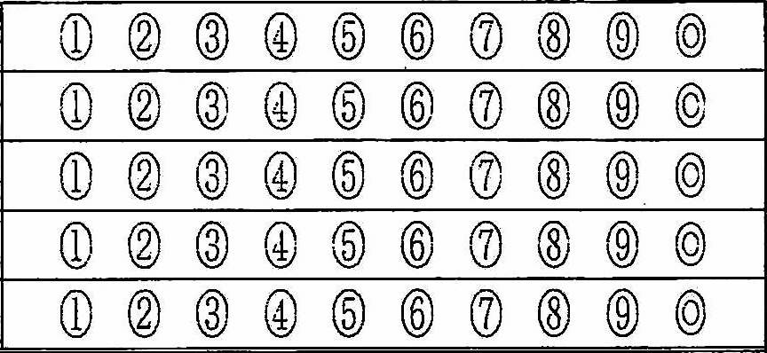

# Auto_Attendance_Management
<!-- TOC -->
目次
==
- [概要](#概要)
- [背景](#背景)
- [プログラム概要](#プログラム概要)
- [SubmitForm](#submitform)
  - [TemplateForm](#templateform)
  - [プログラム環境](#プログラム環境)
<!-- /TOC -->

# 概要
僕が所属している大学の研究室が担当している講義の出席管理のプログラムです 

# 背景
研究室の教授の授業の出席は、講義で出題される課題を記入する欄と名前、学籍番号、質問の項目がある用紙が配られます。

その用紙には学籍番号を記入するワークシートがありました👇

講義を受けていた時はてっきり、このマークを読み込んで出席管理をしているんだな〜
と思っていたのですが、

いざ、研究室に配属されると、マークシートは使わず記入された学籍番号を学生が確認し、エクセルファイルに打ち込むじゃありませんか！！

大変ですね

その後、研究室の同期とこの話になった時に

 **「これを自動化できるプログラム作れるくない？」**

 **なので、作ってみました **
 
 

# プログラム概要
ディレクトリ構造はこちら

それぞれのディレクトリ、ファイルについて簡単に説明していきます

## SubmitForm
&emsp;ここには用紙のpdfを保存する場所です  
&emsp;遅刻ならLateArrival、マークが未記入ならAnonymousへファイルが移動します

## TemplateForm
&emsp;ここはプログラムで使用するテンプレート画像があります。説明が面倒くさいので画像貼ります  
&emsp;（画像の説明は省力で）
 
 
&emsp;&emsp;&emsp;

最後の一枚は上で貼ったマークシートです
 
 

## プログラム環境
プログラム環境についても書いておきます（使用バージョン外の動作は確認していません）
